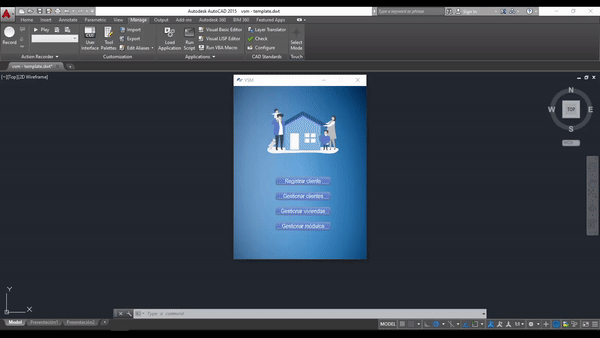

# vsm
Software destinado a la gestión de viviendas sociales en madera y automatización de la tarea de diseño de las mismas en AutoCAD. Contiene una interfaz gráfica desarrollada en Java y la automatización en AutoLISP.

### Ejemplo de funcionamiento

